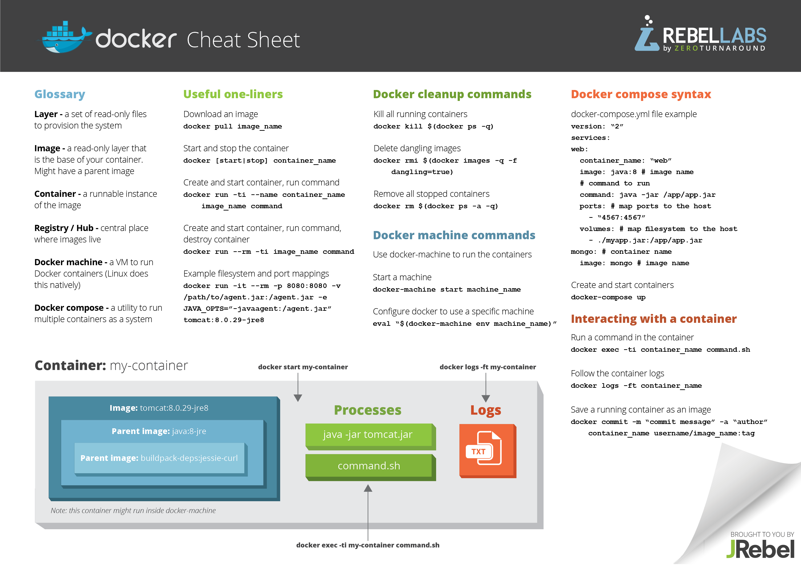

# Docker
[Docker](https://www.docker.com/) is one of the most popular container technology, which automates the deployment of applications by packaging an application with all of its dependencies into software containers. A good introduction to docker can be found [here](http://prakhar.me/docker-curriculum/). Download the Docker engine [here](https://docs.docker.com/engine/installation/). The difference between docker containers and typical Virtual Machines (VMs): 

## Docker useful commands
### Clone a docker container
* `docker pull <image>:latest`. The tag `latest` is not required. Clone the container appropriate for your use case, for eg., use `centos` for the latest version of CentOS. CentOS and most other linux operating systems are available as official repositories from the [Docker Hub](https://hub.docker.com).

* To use non-official docker images, you need to add the organisation before the docker image, for example to pull the latest version of `tensorflow`: `docker pull tensorflow/tensorflow:latest`

### Using a docker image
* The docker image can be used directly from the Docker Hub
* To launch the `centos`  docker container, run `docker run -ti tensorflow/tensorflow:latest /bin/bash`

### Running a container with a local volume mounted
* `docker run -ti -v /home/<user>/<mounted-folder>/:/<path-in-container> cbgeo/cb-geo:latest`

### Connecting to a running container
* `docker exec -ti <containerid> /bin/bash`

### Start / stop a container
* `docker start <containerid>`
* `docker stop <containerid>`

### Delete a container
* `docker rm <containerid>`, stop the container before deleting it. 
* To delete all docker containers `docker rm $(docker ps -a -q)`

### Exposing ports
* To connect to a particular port (for e.g., 3000) in docker container to port `3000` in localhost:
	`docker run -ti -p 3000:3000 tensorflow/tensorflow`

### To login as root
* Launching docker as root user: `docker exec -u 0 -ti <containerid> /bin/bash`

### Creating an image from a docker file

* To build an image from docker file run as root `docker build -t "tensorflow/tensorflow" /path/to/Dockerfile`
* `docker history` will show you the effect of each command has on the overall size of the file.

# Docker cheat sheet

[Docker self-paced training](https://training.docker.com/self-paced-training)

[Docker quick reference sheet](docker-quick-ref.pdf)

