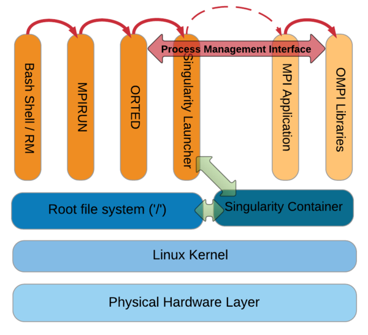

# Hands-on #3: Building MPI containers from scratch

## Singularity and MPI
Singularity has a good integration with MPI. With Singularity, the MPI usage model is to call ‘mpirun’ from outside the container, and reference the container from the ‘mpirun’ command. It has to be installed on all of the nodes that are going to use it. A centralized filesystem works best for this. The mpirun command communicates with the binary via the Process Management Interface (PMI) used by OpenMPI. When MPI run gets executed it forks an Orted process that launches Singularity as a container process. The MPI application within the container is linked to the MPI runtime libraries within the container. The MPI runtime libraries then connect and communicate back to the Orted process via a universal PMI.


> MPI application process for Singularity

Usage would look like this:

```shell
mpirun -np 20 singularity exec container.img /path/to/contained_mpi_prog
```

> **Warning** MPI must be newer or equal to the version inside the container

## Building LAMMPS MPI Singularity configuration file

Create/use the lammps template configuration file `lammps-mpi.cfg` in the `/home` directory.

```shell
BootStrap: yum
OSVersion: 7
MirrorURL: http://mirror.centos.org/centos-%{OSVERSION}/%{OSVERSION}/os/$basearch/
Include: yum

%setup
  cd $SINGULARITY_ROOTFS/opt
  wget http://www.mpich.org/static/downloads/3.2/mpich-3.2.tar.gz
  wget http://lammps.sandia.gov/tars/lammps-stable.tar.gz
  
%post
  yum -y groupinstall "Development Tools"

  mkdir -p /opt/mpich
  cd /opt/mpich
  tar xf ../mpich-3.2.tar.gz --strip-components 1

  ./configure --prefix=/usr/local |& tee log.configure
  make -j |& tee log.make
  make install |& tee log.make_install

  mkdir -p /opt/lammps
  cd /opt/lammps
  tar xf ../lammps-stable.tar.gz --strip-components 1

  cd src
  make yes-granular |& tee log.make_yes_granular
  make -j mpi |& tee log.make_mpi

%runscript
  /opt/lammps/src/lmp_mpi "$@"
```

## Creating the container image

* Create a container called `lammps-mpi.img` and modify the size to 2048 MiB.

```
singularity create --size 2048 lammps-mpi.img`
```

* Bootstrap the lammps configuration file created in the previous step.

```
sudo singularity boostrap lammps-mpi.img lammps-mpi.cfg
```
> **Note** Bootstrapping step requires `root` access.

## Running the container image

To execute the container 

```
mpirun -np 4 singularity run ~/lammps-mpi.img -i in.granregion.mixer
```

To run LAMMPS on Cambridge HPC

```shell
srun -Atraining -pbiocloud-normal --reservation=singularity --mpi=pmi2 -N1 -n24 singularity run ~/lammps.img -i ~/in.mixer
```
