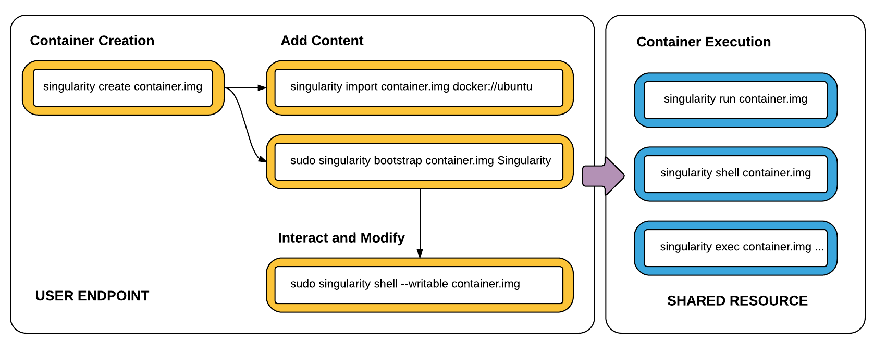

# An introduction to Singularity
Certain container technologies, such as Docker, require privileged access to the underlying operating system, which is often not possible on a university-wide HPC cluster. [Singularity](http://singularity.lbl.gov) is an implementation of a container, and an engine to run those containers without requiring any privileged access (root-access). Singularity containers allow researchers to isolate the software environment needed to produce a result away from the configuration and operating system of the computer that the analysis will be run on. This means that your colleague at University X can run the analysis exactly the same way on their cluster as you are running it on your cluster at University Y, and all it requires is sharing a Git repository (code) and a container image (which includes dependency libraries, software and tools). Singularity is designed for ``Mobility of Compute``, a single-file based container image facilitates distribution, archiving and sharing. Singularity has tighter integration with SLURM, MPI and GPU.

Applications which run in a container run with the same “distance” to the host kernel and hardware as natively running applications. Generally the container daemon is a root owned daemon which will separate out all possible namespaces in order to achieve a fully emulated separation from host and other containers. However, the “Singularity Launcher” is run by the user, loads the Singularity container and executes applications as the user.


> Singularity architecture

## Access privileges
User contexts are always maintained when a Singularity container is launched i.e., when a container is launched by a particular user, the program inside the container will be running as that user. There are no pathways to escalate privileges from within the container.

Invoking an interactive shell within a Singularity container as a regular user:

```shell
[user@centos7-x64 ~]$ whoami
user
[user@centos7-x64 ~]$ singularity shell /tmp/fedora.img
Singularity.fedora.img> whoami
user
```

Invoking an interactive shell within a Singularity container as a sudo user:

```shell
[user@centos7-x64 ~]$ sudo singularity shell /tmp/fedora.img
Singularity.fedora.img> whoami
root
```

## Workflow
The Singularity workflow can be split into two: User end point, which requires superuser / root access and a shared computational end point, where a regular user can execute or run singularity images. Singularity requires root access to create a new container, bootstrap/install and modify containers. However, once a Singularity container image is created, it can be executed by a regular users, without the need for privilege escalation.


> Singularity workflow
